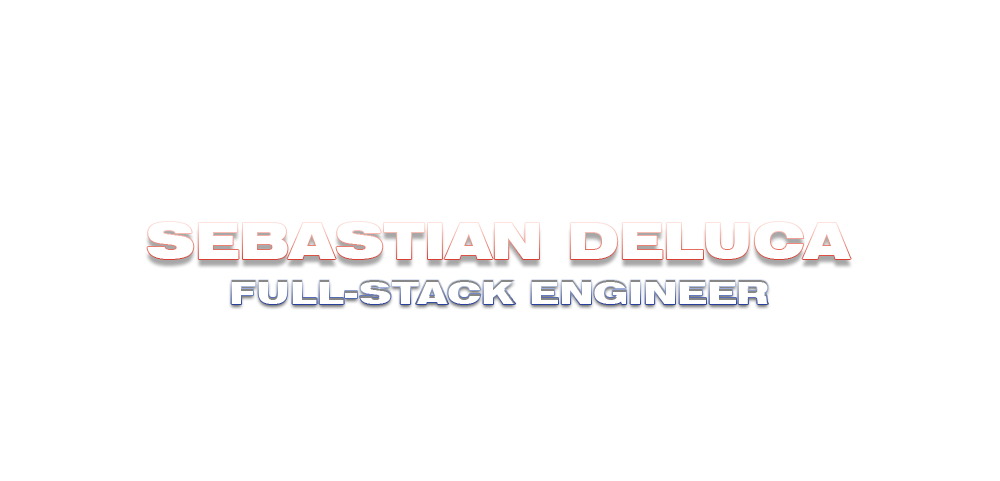

<h2 align="center" style="font-family: 'Afacad Flux'; font-size: 2em; font-weight:bold">ABOUT ME</h2>
<ul>
<li style="font-family: 'Afacad Flux'; font-size: 1.25em;">:book: Bachelor's of Computing, specializing in Software Design - Queen's University</li>
<li style="font-family: 'Afacad Flux'; font-size: 1.25em;">:computer: </b>Python and JS (+ C#, Java, Bash)</li>
<li style="font-family: 'Afacad Flux'; font-size: 1.25em;">:hammer: React, Redux, Django, Flask, MongoDB</li>
</ul>

<h2 align="center" style="font-family: 'Afacad Flux'; font-size: 2em; font-weight:bold">LINKS</h2>

<a style="background-color: #cf392e; color:#ffffff; font-family: 'Afacad Flux'; font-size: 1.5rem; padding:1rem; border:4px solid transparent; border-radius: 15px; margin-right:1rem;" href="https://sebdeluca.com">sebdeluca.com</a>
<a style="background-color: #546e5f; color:#ffffff; font-family: 'Afacad Flux'; font-size: 1.5rem; padding:1rem; border:4px solid transparent; border-radius: 15px; margin-right:1rem;" href="https://www.stratifysoftware.com/">stratifysoftware.com</a>
<a style="background-color: #71b7fb; color:#ffffff; font-family: 'Afacad Flux'; font-size: 1.5rem; padding:1rem; border:4px solid transparent; border-radius: 15px; margin-right:1rem;" href="https://www.linkedin.com/in/sebastian-deluca/">LinkedIn</a>

<h3 align="center" style="font-family: 'Afacad Flux'; font-size: 1.5em; font-weight:bold">CHECK OUT SOME PROJECTS BELOW!</h2>

