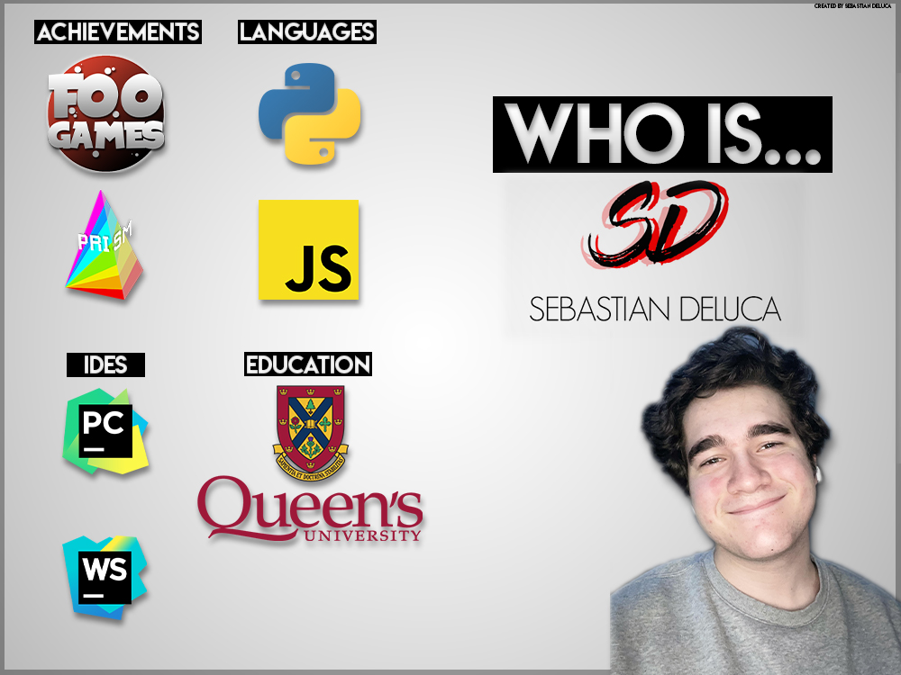

## Hey, I'm Sebastian Deluca.

I'm a software developer currently studying Computing at Queen's University. I enjoy finding creative solutions to problems, and I love learning new things-- especially when it comes to coding.

Some languages I know are Python & JavaScript (my two favourites), and some Java, C, C#, Bash, and more.

Some frameworks I use are Django, React, and Flask.

One of my greatest achievements coding-wise is the pygame-based Prism-- With 3 of my friends under a fake company named "Foo Games", we created a unique storytelling experience as well as created a game that is enjoyable to play, has a lot of replayability, and pushes pygame to its limits. I have some other projects in the 'Greatest Hits' list that you'll see in my repository-- some of them still in progress today.

I currently have four years of coding experience under my belt, even though this experience comes from trying new things, as well as from school projects. I always aspire to try my best and go above and beyond what's expected of me, but above all, I love to code!

If you'd like a more in-depth explanation about me and my coding experience, you can check out [my website](https://sebdeluca.com/)

###### Check out some of my projects below!
